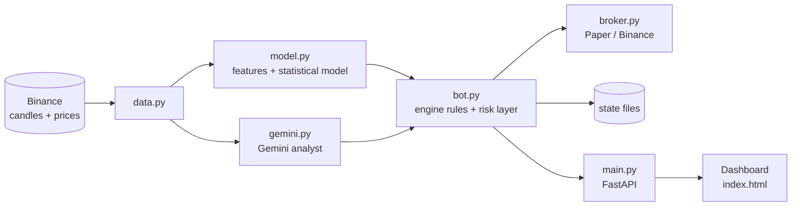

# AI Trader for Binance

A self-hosted **AI-assisted spot trading bot** for Binance. The backend is Python (FastAPI); the control panel is a single HTML page.
A **Gemini** (free API key) analyst and/or a built-in statistical model decide when to buy and sell, and a fixed risk layer
(position sizing, stop-loss, take-profit, daily loss limit) controls every trade.
It starts in **paper mode (simulated money)** and can switch to Testnet or Live from the dashboard.

<!-- Add a screenshot here after you run it:   -->

> ## Important warning
> Trading cryptocurrency is risky. You can lose some or all of your money. This software **does not guarantee profit**,
> is provided **as is, without warranty**, and is **not financial advice**. AI opinions, including Gemini's, are guesses and can be wrong.
> Use paper mode and testnet for weeks before any real money, and only risk money you can afford to lose.
> You are responsible for your own trades and API keys.

## Features

- **Three AI engines you can switch between on the page:**
  **Statistical model** (runs locally, no key), **Gemini** (Google's AI analyses the market and gives BUY / SELL / HOLD with a reason),
  or **Both must agree** (safest).
- **Mode switch on the dashboard:** Paper, Testnet, Live, with a confirmation pop-up. Live needs a typed phrase.
  Switching is only allowed when the bot is stopped and holding nothing.
- **Honest model check:** the statistical model is tested on recent data it never trained on, and the score is shown next to a "just guess" baseline.
- **Risk controls:** ATR-based stop-loss, take-profit, break-even stop, time limit, position-size caps, daily loss limit.
- **Fails safe:** if Gemini is unavailable or over its free limit, the bot opens no new trades on its advice.
- **Web dashboard:** candlestick chart with trade markers, account curve, AI confidence gauges, Gemini's reasoning, open positions, trade history, activity log.
- **Emergency buttons:** "Sell now" per position and "Sell everything and stop".
- **Independent stop-loss monitoring:** a slow AI call can never delay a stop-loss check.
- **Persistent state:** positions and trades survive a restart.
- **One-click Windows launcher** that installs everything and starts the program.

## Quick start

### Windows (easiest)
Download the project, then double-click **`START-AI-TRADER.bat`**. It installs everything, opens the dashboard in your browser, and starts in paper mode.

### Windows / macOS / Linux (manual)
Requires Python 3.10 or newer (3.12 recommended).

```bash
cd backend
python -m venv .venv
source .venv/bin/activate          # Windows: .venv\Scripts\activate
pip install -r requirements.txt
cp .env.example .env               # Windows: copy .env.example .env
python main.py
```

Open **http://127.0.0.1:8000** and press **Start bot**.

### Add Gemini (optional, free)
1. Create a free key at **https://aistudio.google.com/apikey**.
2. In `backend/.env` set `GEMINI_API_KEY=your_key` and `STRATEGY=hybrid`.
3. Restart. The AI panel shows Gemini's status and daily usage.

Free-tier limits vary by model and change often; the bot counts its own calls and stops at `GEMINI_MAX_CALLS_PER_DAY` (default 200).
Free-tier prompts may be used by Google to improve its products. Only market numbers are sent, never your keys or balance.

## Documentation

| Document | For |
|---|---|
| [User manual](docs/USER_MANUAL.md) | Installing, using the dashboard, modes, Gemini setup, every setting, going from paper to live, troubleshooting |
| [Technical report](docs/TECHNICAL_REPORT.md) | Architecture, trading logic, both AI engines, risk management, API, testing results, limitations |

## Trading modes

| Mode | Money | API key | Purpose |
|---|---|---|---|
| `paper` (default) | Simulated, real Binance prices | Not needed | Learning and long-term testing |
| `testnet` | Fake money on Binance's test exchange | Testnet key in `.env` | Testing real order placement |
| `live` | **Real money** | Real key in `.env` + typed confirmation | Only after extensive testing |

Keys are only ever read from `backend/.env`. They are never typed into, or sent through, the web page.

## How it works (short version)



At every new candle (default 15 minutes) the analysis thread asks the selected AI engine for a verdict on each coin.
A buy happens only if the engine(s) agree **and** all safety checks pass. A separate monitor thread checks stops and targets every 10 seconds.
Details are in the [technical report](docs/TECHNICAL_REPORT.md).

## Project structure

```
START-AI-TRADER.bat        Windows one-click installer and launcher
backend/
  main.py                  Web server and API
  bot.py                   Trading loop, engines, risk rules, exits, mode switching, saved state
  model.py                 Features and the statistical model
  gemini.py                Gemini analyst (REST client, prompt, rate limits, parsing)
  broker.py                PaperBroker and CCXTBroker (Binance / testnet)
  data.py                  Binance candles, or synthetic candles for offline tests
  config.py                Reads and validates settings
  smoke_test.py            Offline self-test (uses a mock Gemini server)
  requirements.txt         Python dependencies
  .env.example             All settings with comments
frontend/
  index.html               The dashboard (HTML + CSS + JS, no build step)
docs/
  USER_MANUAL.md
  TECHNICAL_REPORT.md
```

## Before you publish or share this repository

- **Never commit your `.env` file.** It holds your Binance and Gemini keys. The included `.gitignore` excludes it, and also `backend/.venv/` and `backend/data/`.
- Run `git status` before your first commit and confirm `.env` and `.venv` are **not** listed.
- If a key is ever uploaded by mistake, **delete that key** (in Binance and/or Google AI Studio) immediately. Removing it from GitHub later is not enough.
- Do not expose the dashboard to the internet. It has no password and is meant for `127.0.0.1` only.

## Status and limitations

The offline test suite (`python backend/smoke_test.py`, 37 check groups) passes, and the server and dashboard were tested end to end on synthetic data with a mock Gemini server.
The connections to the **real** Binance and Gemini services were **not** exercised during development, so verify them on paper mode and **testnet** first.
Stop-losses are checked by the bot every 10 seconds, not placed as orders on Binance. Neither AI engine has been backtested, and there is no evidence yet that either has a profitable edge.
See the [known limitations](docs/TECHNICAL_REPORT.md#12-known-limitations-and-risks) before using real money.

## License

Add a license file of your choice (for example MIT) before publishing, so others know how they may use the code.
