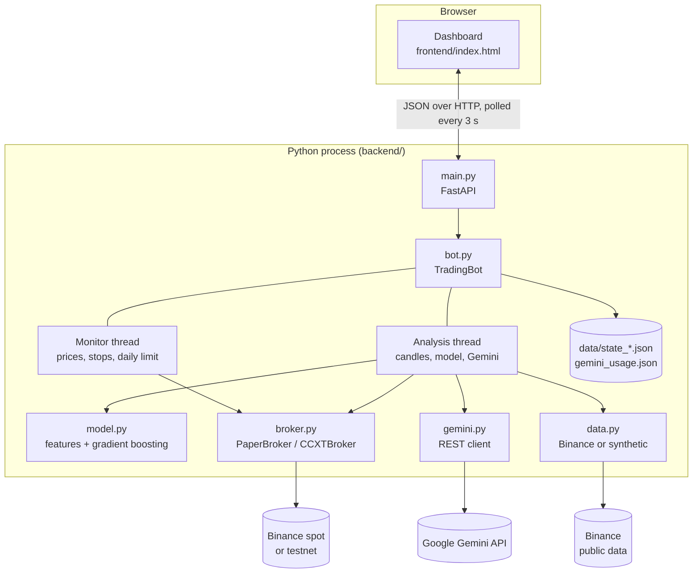
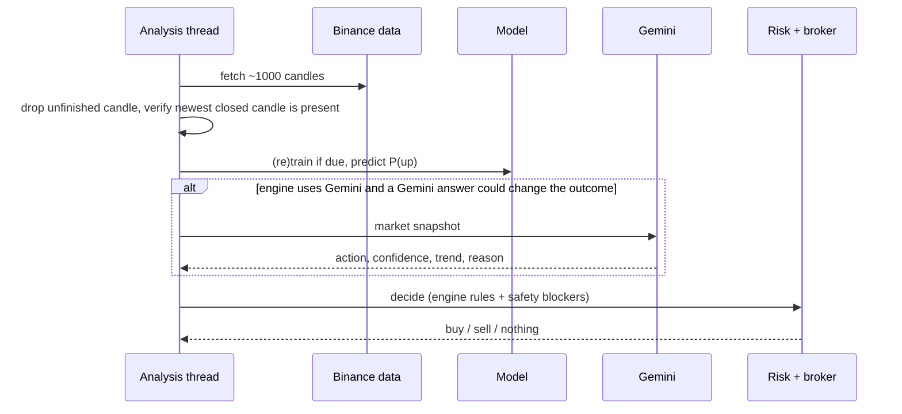

# AI Trader: Technical Report

**Project:** AI Trader for Binance (Python/FastAPI backend, HTML dashboard)
**Scope of this document:** architecture, trading logic, both AI engines, risk management, execution, security, testing results, limitations and future work.
**Audience:** developers and technically minded users who want to understand, review or extend the system.
For installation and day-to-day use, see the [User Manual](USER_MANUAL.md).

> **Disclaimer.** This software is an experiment in automated trading. It provides no guarantee of profit, is offered without warranty,
> and is not financial advice. Section 12 lists what is known not to work well or has not been verified.

**Contents**

1. [Summary](#1-summary)
2. [Goals, scope and non-goals](#2-goals-scope-and-non-goals)
3. [System architecture](#3-system-architecture)
4. [Components](#4-components)
5. [The trading pipeline](#5-the-trading-pipeline)
6. [AI engine 1: statistical model](#6-ai-engine-1-statistical-model)
7. [AI engine 2: Gemini analyst](#7-ai-engine-2-gemini-analyst)
8. [Decision logic by engine](#8-decision-logic-by-engine)
9. [Risk management](#9-risk-management)
10. [Execution: brokers, modes and mode switching](#10-execution-brokers-modes-and-mode-switching)
11. [State, persistence and concurrency](#11-state-persistence-and-concurrency)
12. [Known limitations and risks](#12-known-limitations-and-risks)
13. [Security](#13-security)
14. [Testing and verification](#14-testing-and-verification)
15. [API reference](#15-api-reference)
16. [Design decisions and rationale](#16-design-decisions-and-rationale)
17. [Future work](#17-future-work)
18. [Appendix A: worked trade example](#appendix-a-worked-trade-example)
19. [Appendix B: the Gemini request](#appendix-b-the-gemini-request)

---

## 1. Summary

AI Trader is a self-hosted bot that trades Binance **spot** markets, **long only**, in USDT pairs. Every candle (default 15 minutes) it produces a decision for each coin
using one of three **AI engines**:

| Engine | Description |
|---|---|
| `ml` | A gradient-boosting classifier trained on the coin's recent candles estimates P(price higher in 3 candles). |
| `gemini` | Google's Gemini model receives a numeric market snapshot and returns BUY / SELL / HOLD with a confidence and reason. |
| `hybrid` | Both must agree to buy; either can trigger a sell. |

Whatever the engine says, a fixed **risk layer** (position sizing, ATR-based stop-loss, take-profit, break-even stop, time limit, daily loss limit) controls every order.
The bot runs in `paper` (simulated), `testnet` (Binance test exchange) or `live` (real money) mode; the mode can be switched at runtime from the dashboard under strict conditions.

Headline properties:

- Paper mode by default; live mode needs keys in `.env` **and** a typed confirmation phrase.
- Secrets never pass through the browser.
- Two independent worker threads, so a slow AI call cannot delay stop-loss checks.
- The bot fails safe: if Gemini is unavailable it opens **no** new trades on its advice.
- 37 automated check groups pass on synthetic data and a mock Gemini server. The integration with the **real** Binance and Gemini services was **not** exercised during development (section 14).

---

## 2. Goals, scope and non-goals

**Goals**

1. A beginner can install and run it in a few minutes, safely (paper mode first).
2. The AI's reasoning and reliability are visible, not hidden.
3. Real-money trading requires deliberate steps.
4. Simple enough to read and modify: about 1,500 lines of Python and one HTML file, no database, no build step.

**Non-goals**

- High-frequency or latency-sensitive trading.
- Futures, margin, leverage, shorting, or non-USDT quote currencies.
- Portfolio optimisation, backtesting or strategy research tooling (see section 17).
- Multi-user hosting. The dashboard has no authentication and is intended for `127.0.0.1` only.

---

## 3. System architecture



**Process model.** One Python process runs the FastAPI server (uvicorn) and, when started, two daemon threads owned by `TradingBot`.
The browser only talks to the local API. Keys are read from environment variables (`.env`) at startup and never appear in any API response.

**Data flow per candle** (simplified):



---

## 4. Components

| File | Responsibility |
|---|---|
| `backend/main.py` | FastAPI app, endpoint definitions, startup wiring, serves `index.html`. |
| `backend/bot.py` | `TradingBot`: threads, decision logic per engine, position sizing, exits, daily limit, mode and engine switching, persistence, state snapshot for the UI. |
| `backend/model.py` | Feature engineering (15 features) and `PriceModel` (train, validate, predict). |
| `backend/gemini.py` | `GeminiAnalyst`: prompt construction, REST call, retry, quota accounting, response parsing and sanitising. |
| `backend/broker.py` | `PaperBroker` (simulation) and `CCXTBroker` (Binance via ccxt, live or testnet), `Fill` dataclass, `make_broker`. |
| `backend/data.py` | `BinanceData` (public candles/tickers), `SyntheticData` (deterministic fake series for offline tests). |
| `backend/config.py` | `Config` dataclass, `.env` loading, validation, `public()` view without secrets. |
| `backend/smoke_test.py` | Offline test suite with a mock Gemini server. |
| `frontend/index.html` | The entire dashboard: HTML, CSS, JavaScript, canvas charts. No framework, no build step. |
| `START-AI-TRADER.bat` | Windows launcher: finds/installs Python, creates the venv, installs packages, starts the server, opens the browser. |

Dependencies: `fastapi`, `uvicorn`, `ccxt`, `pandas`, `numpy`, `scipy`, `scikit-learn`, `python-dotenv`, `requests`.

---

## 5. The trading pipeline

### 5.1 Two loops

`TradingBot.start()` launches two daemon threads, each waking every `LOOP_SECONDS` (default 10 s):

**Monitor thread** (`_monitor_step`): fast and light.
1. Fetch the latest price for every symbol.
2. Recompute cash and equity; roll the UTC day.
3. Enforce the daily loss limit.
4. Check every open position for stop-loss, break-even arming, take-profit and time exit.
5. Append to the equity history (at most every 20 s, capped at 1,500 points).

**Analysis thread** (`_analysis_step`): slow, once per new candle per symbol.
1. Compute the current candle boundary (`floor(now / timeframe) * timeframe`, UTC). Skip symbols already processed for this boundary.
2. Download up to 1,000 candles, discard the unfinished one, and require the newest closed candle to be exactly one timeframe before the boundary (otherwise retry on the next wake-up).
3. Train the statistical model if it has never been trained or `RETRAIN_EVERY` (50) candles have passed.
4. Predict P(up).
5. If the engine uses Gemini **and** its answer could change the outcome, call Gemini (outside the shared lock).
6. Under the lock, verify the bot has not been stopped, mark the candle processed, and run `_decide`.

**Why two threads.** A Gemini call can take up to about two minutes in the worst case (three attempts with a 40 s timeout and back-off). Running that in the same loop as the stop-loss checks would leave open positions unmonitored during that time. With separate threads, exits are evaluated every 10 seconds regardless (verified by a test in which Gemini is stalled for 6 seconds: the stop-loss fired in about 0.1 s).

### 5.2 Stop semantics

`stop()` sets an event; both threads exit at their next check. Because an analysis step may be mid-flight, the final step (`_decide`) re-checks the event under the lock and returns without acting if the bot was stopped, so **pressing Stop cannot be followed by a new order**. `start()` refuses (HTTP 409) while a previous thread is still finishing, to avoid duplicate loops.

While stopped, open positions are **not** monitored. The UI warns about this with a banner and the confirmation dialog.

---

## 6. AI engine 1: statistical model

### 6.1 Features (15)

Computed from closed candles only, all scale-free so a model trained on one coin/time is not tied to price level:

| Group | Features |
|---|---|
| Returns | `ret_1`, `ret_3`, `ret_5`, `ret_10`, `ret_20` (percentage change over N candles) |
| Momentum | `rsi` (Wilder, 14), `ema_ratio` (EMA12/EMA26 - 1), `macd_h` (MACD histogram / price) |
| Mean reversion | `bb_pos` (position within 20-candle Bollinger bands) |
| Volatility | `atr_pct` (ATR14 / price), `range_pct` ((high-low)/price) |
| Volume | `vol_z` (48-candle z-score of volume) |
| Trend | `trend_dist` (price / EMA50 - 1) |
| Time | `hour_sin`, `hour_cos` (UTC hour of day) |

### 6.2 Label and model

- **Label:** `1` if `close[t + HORIZON] > close[t]` (default HORIZON = 3 candles), else `0`. This is a *direction* label; it ignores the size of the move and trading costs.
- **Model:** scikit-learn `HistGradientBoostingClassifier(max_depth=3, learning_rate=0.05, max_iter=150, min_samples_leaf=30, l2_regularization=1.0, random_state=42)`. Deliberately small and regularised to limit overfitting on about a thousand rows.
- The last `HORIZON` rows are dropped from training because their outcome is not yet known.

### 6.3 Validation and gating

A single chronological split: the first 80% trains a temporary model, the last 20% (about 190 candles) evaluates it, with a gap of `HORIZON` rows between them to prevent label overlap. Recorded statistics:

| Statistic | Meaning |
|---|---|
| `val_acc` | Accuracy of the temporary model on the held-out 20% (threshold 0.5). |
| `baseline` | Accuracy of always guessing the more common class in that same slice. |
| `conf_n`, `conf_hit` | How many held-out samples had P(up) at or above the buy threshold, and how often price really rose. |

A **final model** is then trained on all rows and used for prediction. The model is "OK to trade" when `val_acc >= MIN_VAL_ACCURACY` (default 0.52). The dashboard shows `val_acc` next to `baseline` for transparency.

### 6.4 Interpreting these numbers honestly

- With about 190 validation samples, the standard error of an accuracy near 50% is about **3.6 percentage points**. A reading of 53% is statistically indistinguishable from chance.
- The gate compares against a fixed number, not against `baseline`. A model can pass the gate while doing worse than the baseline (this happened in testing on synthetic data). Users are shown both numbers; a stricter gate is listed in section 17.
- Short-term crypto returns are close to random and fees are about 0.1% per side, so a modest directional edge may not survive costs.

---

## 7. AI engine 2: Gemini analyst

### 7.1 What Gemini receives

For one coin, `format_prompt` builds a plain-text message containing:

- coin, candle size, current price, and the round-trip trading cost (fees + slippage, about 0.3%);
- bot state: **FLAT**, or **HOLDING** with entry, unrealised P&L, stop and target;
- indicators on the latest closed candle (RSI, EMA gap, MACD histogram, Bollinger position, ATR%, volume z-score, distance from EMA50);
- the statistical model's P(up), its held-out accuracy and baseline, and whether the model passed its gate;
- the last 48 candles as compact text lines (UTC time, open, high, low, close, volume).

It contains **no** API keys, account balances or personal data. It contains no news or free-text from third parties, which keeps the prompt-injection surface very small (all inputs are numbers from Binance).

A system instruction frames Gemini as a cautious analyst for a **long-only spot** bot: BUY only when flat and evidence is clear and larger than costs; SELL only when holding and the rise looks over; otherwise HOLD; use only the given numbers; keep confidence above 0.75 rare; answer in JSON. The full request is in Appendix B.

### 7.2 What Gemini returns

Structured JSON: `action` (BUY/SELL/HOLD), `confidence` (0 to 1), `trend` (UP/DOWN/SIDEWAYS), `reasoning` (at most two short sentences), `risks` (optional). The request asks for `application/json` with a response schema; if the API rejects the schema (HTTP 400) the client retries once asking for plain JSON.

### 7.3 Sanitising the answer

`_parse` is defensive, because model output is untrusted:

- strips Markdown code fences; extracts the first `{...}` if extra text surrounds it;
- unknown action becomes HOLD; confidence outside 0-1 is rescaled or clamped (0-100 style answers are divided by 100);
- **impossible actions for a long-only bot are neutralised:** BUY while holding and SELL while flat both become HOLD;
- reasoning and risks are truncated (400/200 characters);
- the dashboard escapes all model text before display, so model output cannot inject HTML or script.

### 7.4 Rate limiting, quota and failure handling

| Mechanism | Behaviour |
|---|---|
| Minimum interval | At least `GEMINI_MIN_INTERVAL` (7 s) between calls. |
| Daily cap | Stops after `GEMINI_MAX_CALLS_PER_DAY` (200) calls per day (day boundary approximated as midnight Pacific, UTC-8). The count is persisted in `data/gemini_usage.json`. |
| HTTP 429 | Pauses all calls for the API's `retryDelay` (default 60 s); if the message indicates a daily quota, pauses for one hour. |
| HTTP 401/403 | Reports a clear key/permission error; pauses 10 minutes. |
| HTTP 404 | Reports "model not found"; pauses 10 minutes. |
| HTTP 5xx / network errors | Up to three attempts with 2 s and 4 s back-off. |
| Empty/blocked/truncated answer | Reported as an error. |
| Any failure | The bot **opens no new trade on Gemini's advice**; exits by stop-loss/take-profit/time are unaffected. The UI states the reason. |

The API key is sent in the `x-goog-api-key` header (never in the URL) and is never included in error messages, logs or API responses.

### 7.5 Quota-saving call policy

`_needs_gemini` calls Gemini only when the answer could change what the bot does:

- Position open: yes (for a possible exit).
- Flat: only if the cheap safety checks pass (not halted, volatility high enough, trend filter, free position slot, no cooldown), and in `hybrid` mode also only if the statistical model already wants to buy.

Approximate worst case for `gemini` engine, two coins, 15-minute candles: 2 x 96 = 192 calls/day (close to the default cap of 200). `hybrid` uses a small fraction of that.

### 7.6 Model and pricing notes

The default model, `gemini-3.1-flash-lite`, was chosen because it is a current model listed in Google's documentation and lighter "Flash-Lite" models are reported to have the larger free daily allowance. Free-tier limits differ by model, are per Google project, change often, and free-tier content may be used by Google to improve its products; users must check Google AI Studio for their own limits. The model name is configurable (`GEMINI_MODEL`).

---

## 8. Decision logic by engine

`_decide` runs once per symbol per candle. "Base blockers" are engine-independent safety checks:
halted for the day, volatility below `MIN_ATR_PCT`, trend filter (price below EMA50), maximum open positions, cooldown after a recent trade.
"Model blockers" are: model below `MIN_VAL_ACCURACY`, or P(up) below `BUY_THRESHOLD`.
"Gemini blockers" are: Gemini unavailable, or verdict not BUY, or confidence below `GEMINI_MIN_CONFIDENCE`.

| Engine | Buy when | Sell (AI exit) when |
|---|---|---|
| `ml` | no base blockers, no model blockers | P(up) is at or below `SELL_THRESHOLD` |
| `gemini` | no base blockers, no Gemini blockers | Gemini says SELL with enough confidence |
| `hybrid` | no base, model **or** Gemini blockers (all three clear) | Gemini says SELL with enough confidence **or** P(up) at or below `SELL_THRESHOLD` |

In every engine the following exits are also always active, checked every 10 seconds by the monitor thread: stop-loss, break-even stop, take-profit, time limit (`MAX_HOLD_CANDLES`), daily loss limit.

Each trade records its origin: `ai_signal`, `gemini_signal`, `hybrid_signal` (buys) and `ai_exit`, `gemini_exit`, `stop_loss`, `breakeven_stop`, `take_profit`, `time_exit`, `manual`, `daily_loss_limit`, `panic` (sells), so results can be compared per engine.

---

## 9. Risk management

| Control | Mechanism |
|---|---|
| **Position sizing** | `stop_dist = ATR_STOP_MULT x ATR14`. `notional = equity x RISK_PER_TRADE / stop_dist x price`, then capped at `equity x MAX_POSITION_PCT` and at 98% of free cash. Skipped if below `MIN_NOTIONAL` (default 10 USDT) or if `stop_dist >= 30%` of price. |
| **Stop-loss** | Entry fill price minus `stop_dist`. Software-monitored (section 12). |
| **Take-profit** | Entry fill price plus `TAKE_PROFIT_RR x stop_dist`. |
| **Break-even stop** | When price reaches entry + `stop_dist`, the stop is raised to `entry x (1 + 2 x FEE_RATE)`. |
| **Time limit** | Close after `MAX_HOLD_CANDLES` candles. |
| **Max positions** | `MAX_OPEN_POSITIONS`. |
| **Cooldown** | `COOLDOWN_CANDLES` after any close of the same coin; one candle after a failed buy. |
| **Daily loss limit** | If equity falls to `day_start_equity x (1 - DAILY_LOSS_LIMIT)`: sell everything, block new entries until the next UTC day. |
| **Volatility floor** | `MIN_ATR_PCT` avoids trading when moves are too small to beat costs. |
| **Trend filter** | Optional: buy only above EMA50. |
| **Manual controls** | Per-position "Sell now"; "Sell everything and stop". |
| **Config bounds** | `RISK_PER_TRADE <= 5%`, `MAX_POSITION_PCT <= 100%`, `DAILY_LOSS_LIMIT <= 50%`, thresholds ordered; invalid settings stop the program at startup with a list of problems. |

An important practical consequence: with default settings the **position cap (25%)** is almost always tighter than the risk-based size, so the real loss on a stop-out is typically 0.2 to 0.3% of the account, well below `RISK_PER_TRADE` (Appendix A).

---

## 10. Execution: brokers, modes and mode switching

### 10.1 Brokers

Both implement `price`, `quote_balance`, `buy(symbol, quote_amount)`, `sell(symbol, qty)` and return a `Fill(qty, price, quote)` where `quote` is the USDT spent or received **including fees**, so profit is simply `sell.quote - buy.quote`.

- **PaperBroker.** Uses real prices. Buy at `price x (1 + slippage)`, sell at `price x (1 - slippage)`, fee on each side. Cash is tracked locally and persisted.
- **CCXTBroker.** Binance spot through ccxt, market orders only. Amounts are rounded with the exchange's precision rules and checked against the minimum order value. Fees paid in the bought coin are subtracted from the position quantity; fees in USDT are added to cost/subtracted from proceeds; **fees paid in BNB are not converted** (small P&L error). A sell uses `min(position quantity, free balance)` and fails clearly if nothing is available. A re-entrant lock serialises exchange calls because two threads share the exchange object. `testnet` mode calls `set_sandbox_mode(True)`.

Candles always come from Binance's public market data; in testnet mode prices for orders come from the testnet ticker.

### 10.2 Modes

| Mode | Broker | Needs |
|---|---|---|
| `paper` | PaperBroker | nothing |
| `testnet` | CCXTBroker (sandbox) | `BINANCE_API_KEY`, `BINANCE_API_SECRET` |
| `live` | CCXTBroker | keys; and either `LIVE_CONFIRM=I_UNDERSTAND_THE_RISK` in `.env` (if started in live) or the phrase typed in the dashboard (if switched to live) |

Testnet and live are refused with `DATA_SOURCE=synthetic`.

### 10.3 Runtime mode switching

`POST /api/mode` accepts `{mode, confirm}` and succeeds only if **all** hold:

1. the mode is valid and different from the current one;
2. the bot is **stopped** and there are **no open positions** (`switch_blocker`);
3. for testnet/live: real data source and keys present in the environment;
4. for live: `confirm` equals `I_UNDERSTAND_THE_RISK`;
5. a new broker can be built and (for real accounts) `quote_balance()` succeeds, which proves the keys work for that environment.

Only then does `apply_mode` swap the broker, change `cfg.mode`, clear in-memory session data and load that mode's own state file. If step 5 fails, the response is HTTP 502 with the reason and **nothing changes**. The chosen mode is not persisted: the next program start uses `TRADING_MODE` from `.env`. Keys are never accepted from the browser; this keeps them out of the browser, its history and any screenshots.

The UI reflects the mode in three ways: the highlighted switch in the header, the page title prefix (`LIVE - ` / `Testnet - `), and a colored bar across the top of the page (blue, amber, red; thicker for live).

---

## 11. State, persistence and concurrency

### 11.1 Persistence

| File | Content | Notes |
|---|---|---|
| `backend/data/state_<mode>_<data_source>.json` | open positions, last 500 trades, initial equity, current UTC day, day-start equity, paper cash | Written atomically (temp file then rename) after every trade and on day change. Separate file per mode and data source. |
| `backend/data/gemini_usage.json` | today's Gemini call count | Survives restarts so the daily cap holds. |

Not persisted (rebuilt or lost on restart): the equity-history chart, the activity log, latest signals, cooldown timers, trained models (retrained on start).

### 11.2 Concurrency

- Shared state (`positions`, `trades`, `equity`, `signals`, ...) is protected by a single `RLock`. The API's `snapshot()` copies under the lock.
- Network calls (Binance data, Gemini) and model training happen **outside** the lock; order placement and state mutation happen inside it, so manual actions from the API and bot decisions are serialised.
- Each entry decision is taken under the lock after re-checking the stop event.
- The Binance data client and the ccxt broker each have their own lock around the shared exchange objects.

---

## 12. Known limitations and risks

These are deliberate simplifications or unverified areas. Read them before using real money.

**Execution and protection**
1. **Stops are not exchange orders.** Stop-loss and take-profit are checked by the monitor thread every 10 seconds. A fast move can pass the stop before it is noticed, and if the program, the computer or the internet stops, open positions are unprotected. Exchange-side OCO/stop orders would be a substantial safety improvement.
2. **Market orders only.** Real fills can be worse than paper mode's flat 0.05% slippage assumption, especially in thin or fast markets. Paper results are therefore optimistic.
3. **No reconciliation with the exchange.** The bot trusts its own record of positions. If you trade the same coins manually on the same account, or sell outside the bot, the record can diverge. A sell that finds no balance fails and the position stays recorded until the state file is removed (manual step in the User Manual).
4. **Partial fills, order-book depth, dust and BNB fee discounts** are not modelled or fully handled.

**The AI engines**
5. **No proven edge.** Neither engine has been backtested or validated on long histories. Directional accuracy near 50% is expected, and costs can exceed a small edge.
6. **Small validation set and weak gate.** About 190 samples give roughly ±3.6 points of noise; the gate does not require beating the baseline (section 6.4). Retraining every 50 candles can let the gate flip between runs.
7. **Direction label ignores costs and magnitude.** A "correct" call can still lose money after fees.
8. **Gemini's accuracy is not measured** by the bot. Its confidence is an opinion, not a calibrated probability. Answers vary between calls and can change when Google updates a model. A language model reading numeric candles is doing pattern-guessing; it is not evidence of a real edge.
9. **Free-tier constraints.** Quotas vary by model and change; the bot's counter is an approximation of Google's accounting. Free-tier prompts may be used by Google for product improvement (only market numbers are sent).
10. **Not verified against the live services.** The Gemini client was tested against a mock server that follows the documented REST shape; the ccxt/Binance code paths (including testnet sandbox and live order handling) were not run against the real exchange during development. Field names, error formats or model IDs may differ in practice.

**Platform**
11. **Single process, in-memory session data.** No database; charts and logs reset on restart.
12. **No dashboard authentication.** Safe only on `127.0.0.1`.
13. **Spot, long-only, USDT pairs only.** `quote_balance` reads the USDT balance.
14. **Time.** The "day" for the loss limit is UTC; Gemini's quota day is approximated as UTC-8.
15. **The Windows `.bat` launcher** was written and reviewed but not run on Windows during development.

---

## 13. Security

| Topic | Design |
|---|---|
| Secrets | Binance and Gemini keys live only in `backend/.env`, loaded into the server process. `Config.public()` strips them; the API never returns them; the browser never sees or sends them. |
| Repository hygiene | `.gitignore` excludes `.env`, `backend/data/` and `.venv/`. Users are told to run `git status` before committing and to delete a key immediately if it is ever uploaded. |
| Binance key permissions | Documentation instructs: Spot trading only, withdrawals disabled, IP-restricted. |
| Live mode | Two independent deliberate steps: keys present in the environment, and a typed confirmation phrase. Live mode is never auto-started (`AUTO_START_BOT` is ignored). |
| Network exposure | Binds to `127.0.0.1` by default; no authentication, so it must not be exposed. |
| Untrusted output | Gemini output is validated, clamped, truncated and HTML-escaped in the UI; it can only select among three fixed actions. |
| Prompt injection | Inputs to Gemini are purely numeric Binance data; no external text is included. |
| Error messages | The Gemini key is only in a request header, never in URLs or error strings (covered by a test). |
| Supply chain | Standard PyPI packages listed in `requirements.txt`; the dashboard loads only Google Fonts from the network and has no third-party scripts. |

---

## 14. Testing and verification

### 14.1 Automated suite (`python backend/smoke_test.py`)

Runs entirely offline using `SyntheticData` and an in-process **mock Gemini HTTP server**. Result at the time of writing: **37 check groups, all passing**.

| Area | What is verified |
|---|---|
| Statistical model and rules | Signals produced; snapshot is JSON-safe and contains **no secrets**; position within size caps with stop below entry and target above; stop-loss closes at a loss; daily loss limit halts and sells everything; state reloads after restart. |
| Gemini client | Well-formed request (header key, JSON mime type, schema, prompt content); BUY when flat, SELL when holding; tolerates code fences and 0-100 confidence; impossible actions become HOLD; non-JSON rejected; schema-rejection fallback; 429 pauses further calls; 5xx retried then reported; bad key gives a clear error without echoing the key; daily cap enforced; missing key sends nothing. |
| Strategies | `gemini`: BUY placed with the right reason code, SELL closes; low-confidence BUY refused; Gemini outage yields no trades; `hybrid`: Gemini not called when the model already says no, trade when both agree, no trade when Gemini says HOLD; no key falls back to `ml` and refuses to switch to Gemini. |
| Concurrency | A stopped bot opens nothing; a stop-loss fires in about 0.1 s while Gemini is deliberately stalled for 6 s; restart is refused while a previous step is finishing. |
| Mode switching | Blocked while running or holding positions; applies with a separate account/history/state file; switching back restores history. |
| HTTP API | State exposes mode options and Gemini status; real accounts refused with demo data; missing keys give a clear instruction; live needs the exact phrase; bad or unreachable Binance keys produce a clear error and leave the mode unchanged; switching refused while running. |

### 14.2 Dashboard checks

The page was loaded in a DOM emulator (jsdom) against a running server with a mock Gemini and driven programmatically: mode switch highlights the current mode, the AI-engine control and status text render, the Gemini reasoning box appears on the coin card, trade reasons are labelled, the mode dialog opens and shows the correct blocking reason, changing the engine from the UI works, and there were no JavaScript errors. Canvas drawing was stubbed, so the **visual appearance of the charts was not inspected** in a real browser.

### 14.3 Not covered

Real Binance (mainnet or testnet) order placement; the real Gemini API; the Windows `.bat` launcher on Windows; long-duration behaviour (days of continuous running); realistic-market profitability. These should be validated by the user in paper and testnet mode before any live use.

---

## 15. API reference

All endpoints are served locally; bodies and responses are JSON.

| Method and path | Body | Success | Errors |
|---|---|---|---|
| `GET /` | | The dashboard HTML | |
| `GET /api/state` | | Full snapshot (below) | 503 if not ready |
| `GET /api/candles?symbol=BTC/USDT&limit=120` | | `{symbol, timeframe, candles: [[ts,o,h,l,c], ...]}` (cached 10 s; limit clamped to 20-500) | 404 unknown symbol |
| `POST /api/bot/start` | | `{ok}` | 409 previous step still finishing |
| `POST /api/bot/stop` | | `{ok}` | |
| `POST /api/mode` | `{mode, confirm}` | `{ok, mode}` | 400 invalid / unavailable / wrong phrase; 409 running or positions open; 502 cannot connect to Binance |
| `POST /api/strategy` | `{strategy}` (`ml`, `gemini`, `hybrid`) | `{ok, strategy}` | 400 unknown or Gemini key missing |
| `POST /api/positions/close` | `{symbol}` | `{ok}` | 404 no such position; 500 order failed |
| `POST /api/panic` | | `{ok}` (bot stopped, all positions sold) | 500 some positions could not be sold |
| `POST /api/paper/reset` | | `{ok}` | 400 not paper mode or bot running |

**Snapshot fields (`/api/state`):** `mode`, `data_source`, `running`, `halted`, `halt_reason`, `symbols`, `timeframe`, `strategy`,
`gemini` (`enabled`, `model`, `calls_today`, `daily_limit`, `paused_seconds`, `last_error`), `modes` (availability and reason per mode), `switch_blocked`,
`equity`, `cash`, `initial_equity`, `pnl`, `pnl_pct`, `day_pnl`, `day_pnl_pct`, `stats` (`trades`, `win_rate`, `realized_pnl`, `profit_factor`),
`positions`, `trades` (latest 100), `signals` (per coin: `prob_up`, `action`, `reason`, `model` stats, `gemini` verdict), `equity_history`, `logs` (latest 80), `config` (public settings only).

---

## 16. Design decisions and rationale

| Decision | Reasoning |
|---|---|
| Paper mode by default, live behind extra steps | The most costly mistakes are made with real money. |
| Keys only in `.env`; mode switch does not accept keys | Keeps secrets out of the browser and screenshots. Mode switching is a convenience, not a new place to enter secrets. |
| Mode switch only when stopped and flat | Positions belong to one account; switching under an open position would orphan it. |
| Separate monitor and analysis threads | AI calls have unbounded latency; risk exits must not. |
| Gemini as an advisor inside a fixed risk layer | An LLM should not size positions, set stops or override loss limits. |
| Fail safe on Gemini errors | An unavailable advisor means "do nothing new", never "trade blind". |
| `hybrid` calls Gemini only when the model already agrees | Saves the free quota and makes the model the first, cheap filter. |
| REST rather than the Google SDK | One fewer dependency; the request is one JSON POST; easy to mock and test. |
| Gradient boosting, small and regularised | Handles mixed indicators without scaling, trains in seconds on 1,000 rows, less prone to memorising noise than a deep model. |
| Direction label over return regression | Simple and interpretable P(up) that maps directly to thresholds; costs are handled by the risk layer and volatility floor. |
| Software stops | Simple and identical in paper/testnet/live; the cost is the safety gap in section 12. |
| No database; JSON state files | Zero setup; enough for one user's positions and trades. |
| No frontend framework | The dashboard is one file that can be read, edited and served without a build step. |
| Separate state file per mode and data source | Prevents fake-money and real-money records from ever mixing. |

---

## 17. Future work

In rough priority order:

1. **Exchange-side protection:** place OCO/stop-limit orders on Binance so stops survive program or network failure.
2. **Backtesting and walk-forward evaluation** of both engines on long history with realistic fees, to replace 190-sample validation with real evidence; log Gemini's verdicts to score them against outcomes.
3. **Stricter model gate:** require the model to beat the baseline by a margin and to show positive expectancy after costs.
4. **Position reconciliation:** read balances on start and compare with the state file; warn or adopt.
5. **Authentication** for the dashboard (token or password) and optional HTTPS, enabling safe remote use.
6. **Alerts** (Telegram or email) for trades, errors and limit hits.
7. **Limit orders / smarter execution** and partial-fill handling.
8. **Persist charts and logs** (SQLite) and add per-engine performance analytics.
9. **Additional engines or models** behind the same `strategy` interface; multi-timeframe context for Gemini.
10. **Packaging:** installer, Docker image, service definition for 24/7 running.

---

## Appendix A: worked trade example

Account 1,000 USDT; BTC at 60,000; ATR14 = 180; default settings; paper mode (0.1% fee, 0.05% slippage per side).

| Step | Calculation | Result |
|---|---|---|
| Stop distance | 2.0 x 180 | 360 |
| Size by risk | 1,000 x 1% / 360 x 60,000 | 1,666.67 USDT |
| Caps | 25% of equity; 98% of cash | **250.00 USDT** (cap binds) |
| Entry fill | 60,000 x 1.0005 | 60,030.00 |
| Quantity | 250 x 0.999 / 60,030 | 0.00416042 BTC |
| Stop | 60,030 - 360 | 59,670.00 |
| Target | 60,030 + 2 x 360 | 60,750.00 |
| Break-even arms at | 60,030 + 360 | 60,390.00 (stop moves to 60,150.06) |

| Exit | Sell price after slippage | Received | P&L | % of account |
|---|---|---|---|---|
| Stop-loss at 59,670 | 59,640.17 | 247.88 | -2.12 | -0.21% |
| Take-profit at 60,750 | 60,719.62 | 252.37 | +2.37 | +0.24% |
| Break-even stop at 60,150.06 | 60,119.98 | 249.87 | -0.13 | -0.01% |

Observations: costs of roughly 0.3% per round trip take a large share of each win; the "break-even" stop is slightly negative because exit slippage is not included in its level; and the realised risk (0.21%) is far below `RISK_PER_TRADE` (1%) because the position cap binds.

---

## Appendix B: the Gemini request

`POST {base}/v1beta/models/{model}:generateContent` with header `x-goog-api-key: <key>` and this body (abridged):

```json
{
  "systemInstruction": { "parts": [{ "text": "You are a cautious crypto market analyst supporting an automated SPOT trading bot ... Reply with JSON only." }] },
  "contents": [{ "role": "user", "parts": [{ "text": "<market snapshot text>" }] }],
  "generationConfig": {
    "temperature": 0.2,
    "maxOutputTokens": 2048,
    "responseMimeType": "application/json",
    "responseSchema": {
      "type": "OBJECT",
      "properties": {
        "action":     { "type": "STRING", "enum": ["BUY", "SELL", "HOLD"] },
        "confidence": { "type": "NUMBER" },
        "trend":      { "type": "STRING", "enum": ["UP", "DOWN", "SIDEWAYS"] },
        "reasoning":  { "type": "STRING" },
        "risks":      { "type": "STRING" }
      },
      "required": ["action", "confidence", "trend", "reasoning"]
    }
  }
}
```

Example market snapshot (abridged):

```
Coin: BTC/USDT | candle size: 15m | current price: 60123.5
Round-trip trading cost is about 0.30% (fees + slippage), so small moves lose money.
Bot state: FLAT (no position)
Indicators on the latest closed candle: RSI14=57.2; EMA12 vs EMA26=+0.12%; MACD histogram=+0.020% of price; Bollinger position=+0.30 (...); ATR=0.30% of price; volume z-score=+0.5; price vs EMA50=+0.40%
Statistical model (gradient boosting) estimates P(price higher in 3 candles) = 0.60. On unseen data it scored 53.0% vs a 51.0% guessing baseline (reliable enough to use).
Recent candles, oldest first (UTC time, open, high, low, close, volume):
09-19 08:00 60010 60080 59990 60050 12.4
...
```
